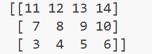
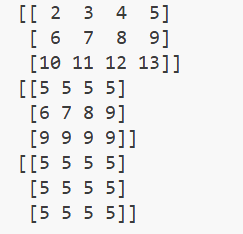

- [概念](#概念)
  - [numpy属性](#numpy属性)
  - [numpy创建array](#numpy创建array)
    - [生成int类型的矩阵](#生成int类型的矩阵)
    - [生成二维矩阵](#生成二维矩阵)
    - [初始化零矩阵](#初始化零矩阵)
    - [全为1的数组](#全为1的数组)
    - [empty](#empty)
    - [.arange(头,尾,步长)](#arange头尾步长)
    - [reshape](#reshape)
    - [线段linspace](#线段linspace)
  - [numpy运算](#numpy运算)
    - [一维向量基础加减](#一维向量基础加减)
    - [乘法](#乘法)
    - [np的内置函数](#np的内置函数)
    - [下标有关的内置函数](#下标有关的内置函数)
    - [找最大值位置，最小值位置](#找最大值位置最小值位置)
    - [nonzero](#nonzero)
    - [sort](#sort)
    - [转置](#转置)
    - [裁剪](#裁剪)

## 概念
Python List: 本质是指针数组。列表中的每个元素都是一个完整的 Python 对象（Object），在内存中可能散落各处。
每次访问都需要“解引用”，带来巨大的寻址开销。

NumPy ndarray: 本质是连续内存块。所有元素类型相同（Homogeneous），像 C 语言数组一样紧密排列。
CPU 缓存（L1/L2 Cache）可以预取这些连续数据，实现极高的处理速度。

### numpy属性
```
import numpy as np
array=np.array([[1,2,3],
                [2,3,4]])
print(array)
print('number of dim:',array.ndim)
print('shape:',array.shape)
print('size:',array.size)
```
****
### numpy创建array
#### 生成int类型的矩阵
**使用`dtype`规定类型**
```
a=np.array([2,23,4],dtype=int)              #生成int类型的矩阵
print(a.dtype)                              #默认为int64

b=np.array([2,23,4],dtype=np.int32)         #生成int32类型的矩阵
```
#### 生成二维矩阵
**直接看代码吧**
```
c=np.array([[2,23,4],                       #生成二维矩阵
            [2,32,4]])
print(c)
```
#### 初始化零矩阵
**`.zeros((形状))`**
```
d=np.zeros((3,4,5))                         #多个0记得加s,规定矩阵形状
print(d)
```
#### 全为1的数组
```
e=np.ones((3,4),np.int16)                   #规定矩阵形状
print(e)
```
#### empty
```
f=np.empty((3,4))                           #生成了一个几乎为0的数组
print(f)
```
#### .arange(头,尾,步长)
```
g=np.arange(10,20,2)                        #类似于list里面的range
print(g)                                    #[10 12 14 16 18],记得左闭右开
```
#### reshape
```
h=np.arange(12).reshape(3,4)                #reshape重新定义形状
print(h)
"""
[[ 0  1  2  3]
 [ 4  5  6  7]
 [ 8  9 10 11]]
"""
```
#### 线段linspace
**`.linspace(头,尾,段数)`**
```
i=np.linspace(1,10,20)                      
j=np.linspace(1,10,5)
```
****
### numpy运算
#### 一维向量基础加减
**就是基础加减**
```
import numpy as np
from math import sin
a=np.array([10,20,30,40])
b=np.arange(4)
c=a-b
print(c)                          #[10 19 28 37]-->矩阵减法
d=a+b               
print(d)                          #[10 21 32 43]-->矩阵加法
e=b**2
print(e)                          #[0 1 4 9]-->矩阵乘方
f=10*np.sin(a)
print(f)                          #[-5.44021111  9.12945251 -9.88031624  7.4511316 ]
print(b==3)                       #[False False False  True]
```
#### 乘法
```
import numpy as np
a=np.arange(4).reshape(2,2)
b=np.array([[0,1],
            [1,2]])
print(a)
print(b)
c=a*b                       #对应位置元素相乘
print(c)
d=np.dot(a,b)               #标准左行右列的计算
e=a.dot(b)
print(d)
print(e)
```
#### np的内置函数
**分维度操作**
*假设数组形状是 (A, B, C, D)：*
*axis=0 $\rightarrow$ 删掉 A，结果形状是 (B, C, D)*
*axis=1 $\rightarrow$ 删掉 B，结果形状是 (A, C, D)*
*axis=2 $\rightarrow$ 删掉 C，结果形状是 (A, B, D)*
*axis=3 $\rightarrow$ 删掉 D，结果形状是 (A, B, C)*
**求和**
`np.sum()`
**最大最小**
`np.max()`
`np.min()`
**平均值**
`np.average()`
**中位数**
`np.median()`
**累加**
`np.cumsum()`   
具体可以参考代码（类似于前缀和）
**累差**
`np.diff()`     
类似于差分，但是是按第一维度运算的
```
import numpy as np
a=np.random.random((2,4))       #前一个是模块，后一个是函数
print(a)
print(np.sum(a))
print(np.min(a))
print(np.max(a))
print(np.sum(a,axis=1))         #指定维数进行计算   axis=1代表横向统计,axis=0代表纵向统计
print(np.max(a,axis=0))         #axis等于n，就把第(n+1)维消掉
```
#### 下标有关的内置函数
#### 找最大值位置，最小值位置
`np.argmin()`     `np.argmax()`
```
import numpy as np
a=np.arange(2,14).reshape((3,4))
print(a)
min_index=np.argmin(a)              #最小值索引
print(min_index)
max_index=np.argmax(a)              #最大值索引
print(max_index)
```
#### nonzero
返回非零元素的坐标
```
import numpy as np
a=np.arange(2,14).reshape((3,4))
print(np.nonzero(a))
#结果：(array([0, 0, 0, 0, 1, 1, 1, 1, 2, 2, 2, 2]), array([0, 1, 2, 3, 0, 1, 2, 3, 0, 1, 2, 3]))
```

#### sort
```
p=np.arange(14,2,-1).reshape((3,4))
print(np.sort(p))
#结果如图
```

#### 转置
`np.transpose()`
```
print(np.transpose(a))              #转置
print((a.T).dot(a))                 #矩阵a与矩阵a的转置相乘
```
#### 裁剪
`.clip(数组名,min,max)`
step1:把数组里面小于min的全部改成min
step2:把数组里面大于max的全部改成max
```
import numpy as np
a=np.arange(2,14).reshape((3,4))
print(a)
print(np.clip(a,5,9))
print(np.clip(a,9,5))
#print(np.mean(a,axis=0))
#结果如图
```

